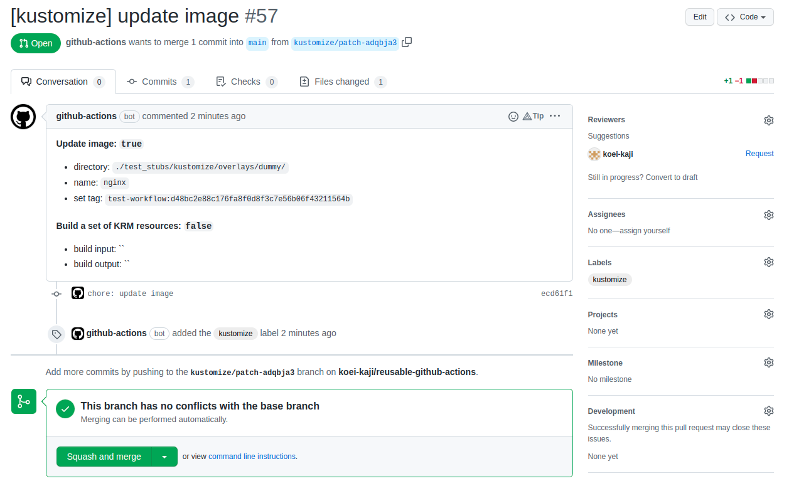
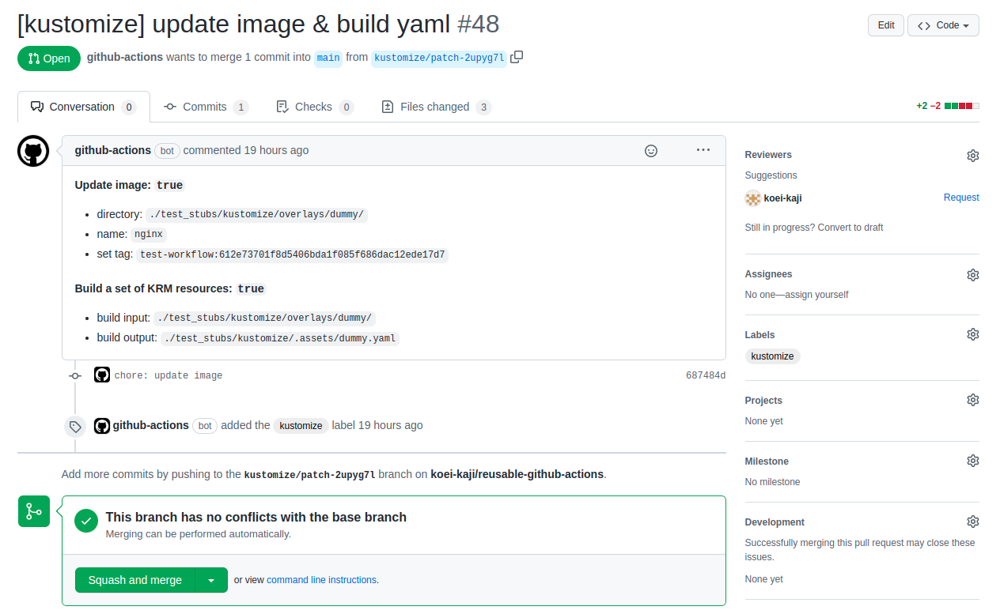
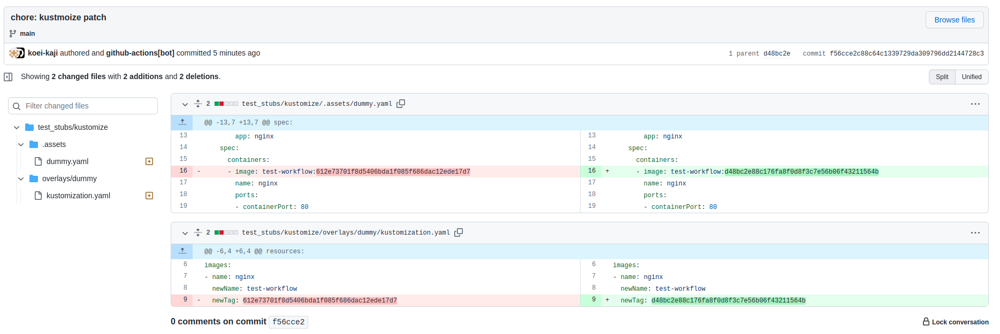

# [kustomize-set-image-and-build]

This workflow is intended to execute kustomize command for updating image of the kustomization, and building a set of KRM.  

## Workflow main behavior

- Optional: Set image and its new name in the kustomization file
- Optional: Build a set of KRM
  - If built, validate yaml w/ [kubeval]
- Selection:
  - Commit and push automatically
  - (Optional) Create pull request

## Usage

```yaml
    uses: koei-kaji/reusable-github-actions/.github/workflows/kustomize-set-image-and-build.yaml@{ref}
    secrets:
      token: ${{ secrets.GITHUB_TOKEN }}
      docker-tag: docker-image:tag
    with:
      updates-image: true
      image-set-directory: "./path/to/dir/image_set/"
      image-set-name: "image"
      builds-yaml: true
      input-build-directory: "./path/to/dir/input_build/"
      output-build-filepath: "./path/to/dir/output_build/build.yaml"
```

## Workflow secret inputs

| Name         | Description             |
| ------------ | ----------------------- |
| `token`      | GitHub token.           |
| `docker-tag` | Docker tag set to name. |

## Workflow inputs

| Name                    | Description                                                                                                             | Default |
| ----------------------- | ----------------------------------------------------------------------------------------------------------------------- | ------- |
| `updates-image`         | Whether to set image and its new name in the kustomization file.                                                        | `false` |
| `image-set-directory`   | Relative directory path under `GITHUB_WORKSPACE` to the repository. The kustomization file in the directory is updated. | -       |
| `image-set-name`        | Image name set new name and tag.                                                                                        | -       |
| `builds-yaml`           | Whether to build a set of KRM                                                                                           | `false` |
| `input-build-directory` | Relative directory path under `GITHUB_WORKSPACE` to the repository. The resources in the directory is built.            | -       |
| `output-build-filepath` | Relative file path under `GITHUB_WORKSPACE` to the repository. Kustomize outputs to the file.                           | -       |
| `pushes-auto`           | Whether to push git diff automatically. If false, create pull request alternatively.                                    | `false` |

## Workflow outputs

Nothing.  

## Examples

### Create PR after updating

```yaml
  # ...
  test-build-pr:
    uses: koei-kaji/reusable-github-actions/.github/workflows/kustomize-set-image-and-build.yaml@main
    secrets:
      token: ${{ secrets.GITHUB_TOKEN }}
    with:
      builds-yaml: true
      input-build-directory: "./test_stubs/kustomize/overlays/dummy/"
      output-build-filepath: "./test_stubs/kustomize/.assets/dummy.yaml"
  # ...
```



### Create PR after updating & building

```yaml
  # ... 
  test-update-and-build-pr:
    uses: koei-kaji/reusable-github-actions/.github/workflows/kustomize-set-image-and-build.yaml@main
    secrets:
      token: ${{ secrets.GITHUB_TOKEN }}
      docker-tag: test-workflow:${{ github.sha }}
    with:
      updates-image: true
      image-set-directory: "./test_stubs/kustomize/overlays/dummy/"
      image-set-name: "nginx"
      builds-yaml: true
      input-build-directory: "./test_stubs/kustomize/overlays/dummy/"
      output-build-filepath: "./test_stubs/kustomize/.assets/dummy.yaml"
  # ... 
```



### Push after running workflow that updating & building

```yaml
  # ...
  test-update-and-build-push:
    uses: koei-kaji/reusable-github-actions/.github/workflows/kustomize-set-image-and-build.yaml@main
    secrets:
      token: ${{ secrets.GITHUB_TOKEN }}
      docker-tag: test-workflow:${{ github.sha }}
    with:
      updates-image: true
      image-set-directory: "./test_stubs/kustomize/overlays/dummy/"
      image-set-name: "nginx"
      builds-yaml: true
      input-build-directory: "./test_stubs/kustomize/overlays/dummy/"
      output-build-filepath: "./test_stubs/kustomize/.assets/dummy.yaml"
      pushes-auto: true
  # ...
```



## Actions built with

- [actions/checkout]
- [peter-evans/create-pull-request]

[kustomize-set-image-and-build]: ../.github/workflows/kustomize-set-image-and-build.yaml

[kubeval]: https://github.com/instrumenta/kubeval

[actions/checkout]: https://github.com/marketplace/actions/checkout
[peter-evans/create-pull-request]: https://github.com/marketplace/actions/create-pull-request