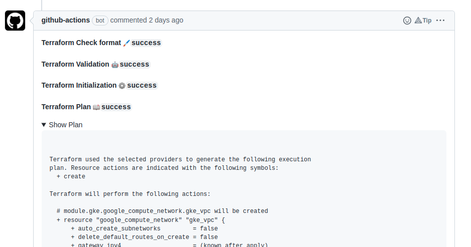
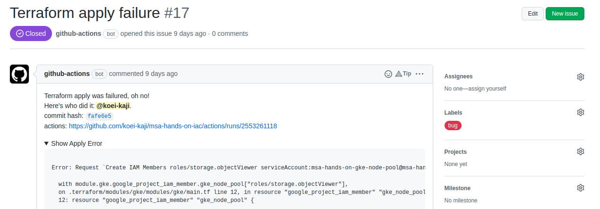

# terraform-with-google-cloud

This workflow is intended to execute [terraform] with Google Cloud.  
It is assumed below.

- Using workload identity federation  
- Not using terraform workspace

## Workflow main behavior

- Authenticate to Google Cloud by workload identity federation
- Check format using given command
- Lint using given command
- Run terraform init
- Run terraform plan
  - (Optional) Update PR to comment summary of the result
- (Optional) Run terraform apply
  - (Optional) Create an issue if failure

## Usage

```yaml
    uses: koei-kaji/reusable-github-actions/.github/workflows/terraform-with-google-cloud.yaml@{ref}
    secrets:
      workload-identity-provider: ${{ secrets.DEV_WORKLOAD_IDENTITY_PROVIDER }}
      service-account: ${{ secrets.DEV_SERVICE_ACCOUNT }}
      backend-gcs: ${{ secrets.DEV_BACKEND_GCS }}
      tf-vars: ${{ secrets.DEV_TF_VAR }}
      token: ${{ secrets.GITHUB_TOKEN }}
    with:
      environment-directory: "./environments/dev/"
      terraform-version: 1.2.1
      update-pull-request: true
```

## Workflow secret inputs

| Name                         | Description                                                                                         |
|------------------------------|-----------------------------------------------------------------------------------------------------|
| `workload-identity-provider` | See [google-github-actions/auth:action.yml].                                                        |
| `service-account`            | See [google-github-actions/auth:action.yml].                                                        |
| `backend-gcs`                | Google Cloud Storage for terraform backend, for example: `gs://project-id/tf-state`                 |
| `tf-vars`                    | Environment variables can be used to set variables, for example: `TF_VAR_hello='{hello=\"world\"}'` |
| `token`                      | GitHub Token for updating PR or creating an issue.                                                  |

## Workflow inputs

| Name                    | Description                                                                                       | Default                           |
|-------------------------|---------------------------------------------------------------------------------------------------|-----------------------------------|
| `environment-directory` | Target environment directory. Relative directory path under `GITHUB_WORKSPACE` to the repository. | `.`                               |
| `terraform-version`     | Terraform version.                                                                                | -                                 |
| `command-check-format`  | Command to execute for checking format.                                                           | `terraform fmt -recursive -check` |
| `command-lint`          | Command to execute for linting.                                                                   | `terraform validate`              |
| `do-apply`              | Whether to run terraform apply                                                                    | `false`                           |
| `update-pull-request`   | Whether to update PR if action event is `pull_request`.                                           | `false`                           |
| `create-issue`          | Whether to create an issue if outcome of applying was in failure.                                 | `false`                           |

## Workflow outputs

Nothing.  

## Examples

### Update PR

```yaml
  # ...
  plan-dev:
    uses: koei-kaji/reusable-github-actions/.github/workflows/terraform-with-google-cloud.yaml@main
    with:
      environment-directory: "./environments/dev/"
      terraform-version: 1.2.1
      update-pull-request: true
    secrets:
      workload-identity-provider: ${{ secrets.DEV_WORKLOAD_IDENTITY_PROVIDER }}
      service-account: ${{ secrets.DEV_SERVICE_ACCOUNT }}
      backend-gcs: ${{ secrets.DEV_BACKEND_GCS }}
      tf-vars: ${{ secrets.DEV_TF_VAR }}
      token: ${{ secrets.GITHUB_TOKEN }}
  # ...
```



### Create issue if `terraform apply` is in failure

```yaml
  # ...
  apply-dev:
    uses: koei-kaji/reusable-github-actions/.github/workflows/terraform-with-google-cloud.yaml@main
    with:
      environment-directory: "./environments/dev/"
      terraform-version: 1.2.1
      do-apply: true
      create-issue: true
    secrets:
      workload-identity-provider: ${{ secrets.DEV_WORKLOAD_IDENTITY_PROVIDER }}
      service-account: ${{ secrets.DEV_SERVICE_ACCOUNT }}
      backend-gcs: ${{ secrets.DEV_BACKEND_GCS }}
      tf-vars: ${{ secrets.DEV_TF_VAR }}
      token: ${{ secrets.GITHUB_TOKEN }}
  # ...
```



## Actions built with

- [getsentry/action-github-app-token]
- [actions/checkout]
- [google-github-actions/auth]
- [hashicorp/setup-terraform]
- [actions/github-script]

[google-github-actions/auth:action.yml]: https://github.com/google-github-actions/auth/blob/95a6bc2a27ae409a01ea58dd0732eccaa088ec07/action.yml

[getsentry/action-github-app-token]: https://github.com/marketplace/actions/
[actions/checkout]: https://github.com/marketplace/actions/checkout
[google-github-actions/auth]: https://github.com/marketplace/actions/authenticate-to-google-cloud
[hashicorp/setup-terraform]: https://github.com/marketplace/actions/hashicorp-setup-terraform
[actions/github-script]: https://github.com/marketplace/actions/github-script